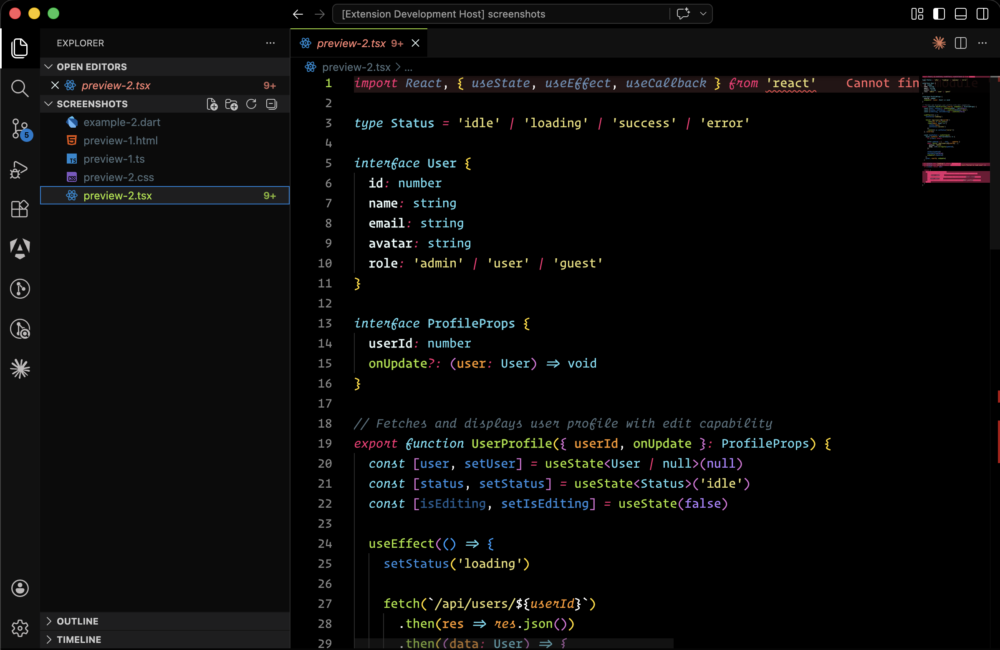
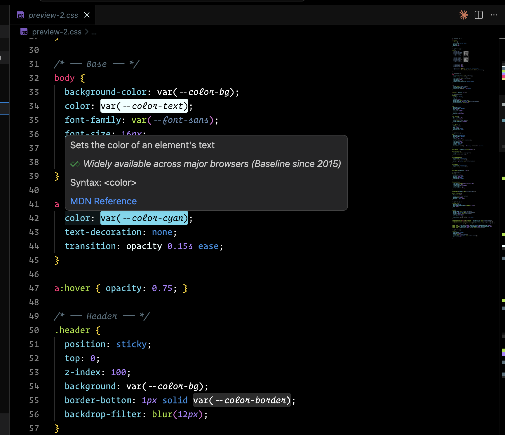
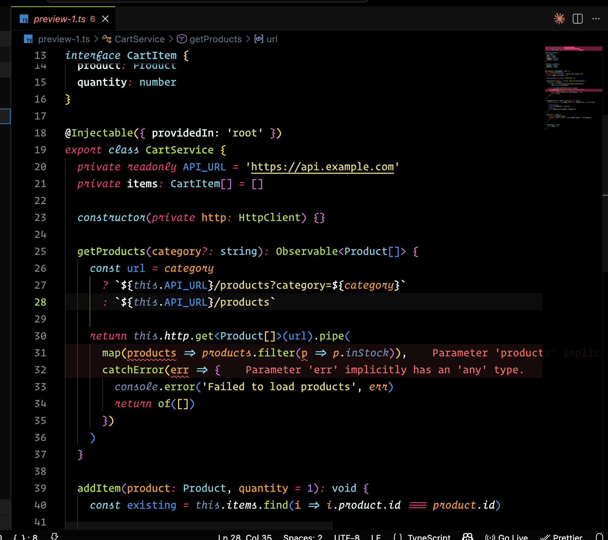
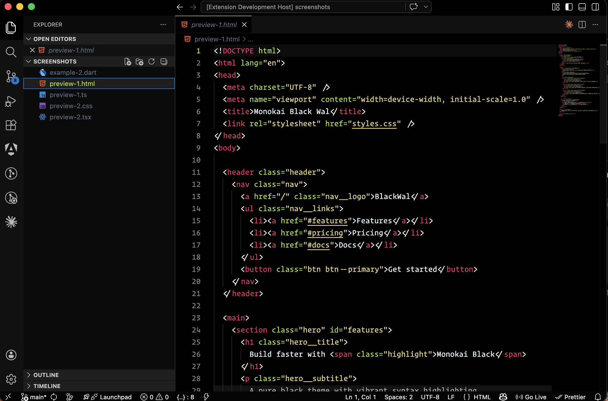
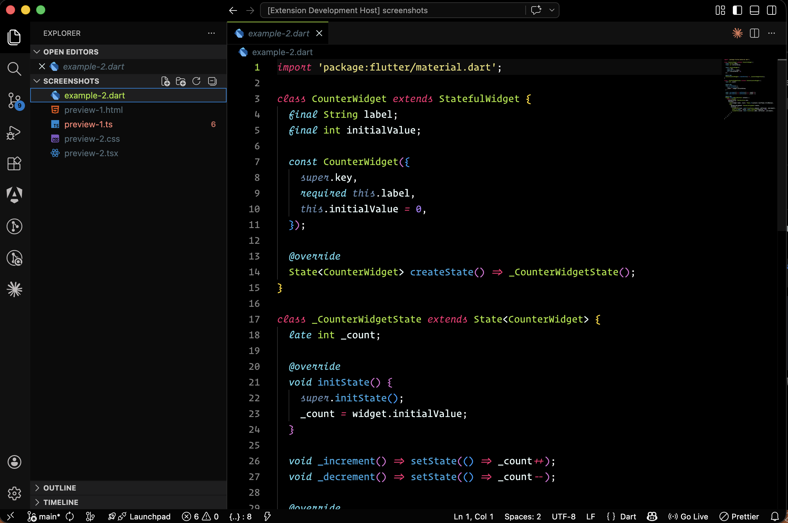

# Monokai Black Wal

A dark VSCode theme with a pure black background, built on the Monokai color palette. High contrast, clean, and easy on the eyes during long coding sessions.

## Preview

## Installation

1. Open **Extensions** in VSCode (`Cmd+Shift+X`)
2. Search for `Monokai Black Wal`
3. Click **Install**
4. Open the Command Palette (`Cmd+Shift+P`) → **Color Theme** → select `Monokai Black Wal`

## Color Palette

| Role | Color |
|---|---|
| Background | `#000000` |
| Foreground | `#eeffff` |
| Keywords | `#f92672` |
| Functions | `#a6e22e` |
| Strings | `#e6db74` |
| Numbers | `#ae81ff` |
| Types | `#66d9ef` |
| Comments | `#546E7A` |
| Variables | `#678CB1` |

## What's covered

- Full syntax highlighting for JavaScript, TypeScript, Dart, HTML, CSS/SCSS, JSON, Markdown and more
- Semantic highlighting for precise colorization of classes, types, functions, parameters and modifiers
- Integrated terminal with a complete 16-color ANSI palette
- Git decorations in the Explorer (added, modified, deleted, untracked)
- Editor UI: tabs, breadcrumbs, minimap, scrollbar, peek view, suggestions, notifications

## Changelog

See [CHANGELOG.md](CHANGELOG.md) for the full history.

## License

MIT
